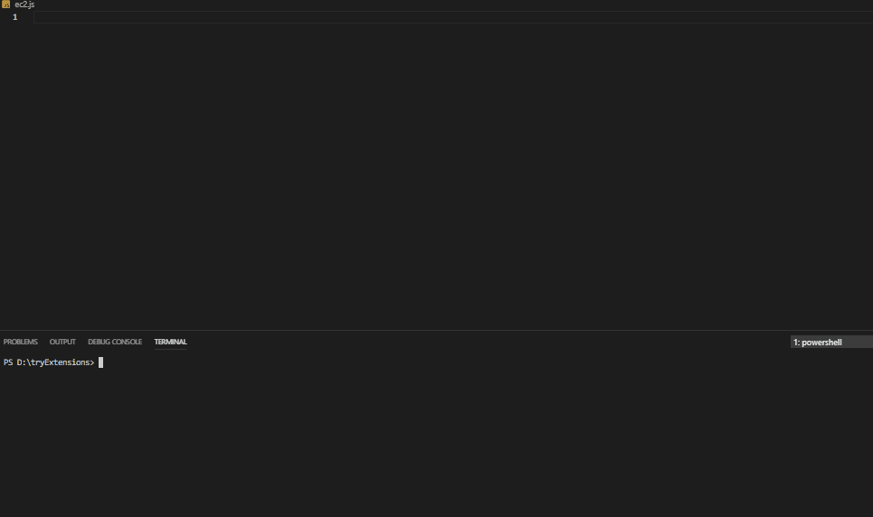

## aws-sdk snippets pack for node js

### A snippet pack to make you more productive working with aws-sdk library for Javascript/NodeJS



&nbsp; &nbsp; &nbsp;
&nbsp; &nbsp; &nbsp;

### Here's the full list of all the snippets:

## Shortcuts / Commands

| Cloud watch commands | Description |
| --- | --- |
| aws.cw.deleteAlarms   | cloud watch delete Alarms |
| aws.cw.describeAlarms | cloud watch describe Alarms |
| aws.cw.disableAlarmActions | cloud watch disable Alarm Actions |
| aws.cw.putMetricAlarm | cloud watch put Metric Alarm |
| aws.cw.listMetrics | cloud watch list Metrics |
| aws.cw.putMetricData | cloud watch put Metric Data |
| aws.cw.putEvents | cloud watch put Events |
| aws.cw.putRule | cloud watch put Rule |
| aws.cw.putTargets | cloud watch put Targets |
| aws.cw.deleteSubscriptionFilter | cloud watch delete Subscription Filter |
| aws.cw.describeSubscriptionFilters | cloud watch describe Subscription Filters |
| aws.cw.putSubscriptionFilter &nbsp;&nbsp;&nbsp;&nbsp;&nbsp;&nbsp;&nbsp;&nbsp;&nbsp;&nbsp;&nbsp;&nbsp;&nbsp;&nbsp;| cloud watch put Subscription Filter |

&nbsp; &nbsp; &nbsp;
&nbsp; &nbsp; &nbsp;

| dynamoDB commands | Description |
| --- | --- |
| aws.ddb.batchGetItem | dynamoDB batch Get Item |
| aws.ddb.batchWriteItem | dynamoDB batch Write Item |
| aws.ddb.createTable | dynamoDB create Table |
| aws.ddb.deleteItem | dynamoDB delete Item |
| aws.ddb.deleteTable | dynamoDB delete Table |
| aws.ddb.describeTable | dynamoDB describe Table |
| aws.ddb.getItem | dynamoDB get Item |
| aws.ddb.listTables | dynamoDB list Tables |
| aws.ddb.putItem | dynamoDB put Item |
| aws.ddb.query | dynamoDB query |
| aws.ddb.scan | dynamoDB scan |
| aws.ddbdoc.delete | dynamoDB delete |
| aws.ddbdoc.get | dynamoDB doc get |
| aws.ddbdoc.put | dynamoDB doc put |
| aws.ddbdoc.query | dynamoDB doc query |
| aws.ddbdoc.update &nbsp; &nbsp; &nbsp;&nbsp;&nbsp;&nbsp;&nbsp;&nbsp;&nbsp;&nbsp;&nbsp;&nbsp;&nbsp;&nbsp;&nbsp; &nbsp; &nbsp;&nbsp; &nbsp; &nbsp;  &nbsp;| dynamoDB doc update |

&nbsp; &nbsp; &nbsp;
&nbsp; &nbsp; &nbsp;

| EC2 commands | Description |
| --- | --- |
| aws.ec2.allocateAddress | ec2 allocate Address |
| aws.ec2.createinstances | ec2 create instances |
| aws.ec2.terminateInstances | ec2 terminate Instances |
| aws.ec2.createKeyPair | ec2 create Key Pair |
| aws.ec2.createSecurityGroup | ec2 create Security Group |
| aws.ec2.deleteKeyPair | ec2 delete Key Pair |
| aws.ec2.deleteSecurityGroup | ec2 delete Security Group |
| aws.ec2.describeAddresses | ec2 describe Addresses |
| aws.ec2.describeInstances | ec2 describe Instances |
| aws.ec2.describeKeyPairs | ec2 describe Key Pairs |
| aws.ec2.describeregionsandzones | ec2 describe regions and zones |
| aws.ec2.describeSecurityGroups | ec2 describe Security Groups |
| aws.ec2.monitorInstances | ec2 monitor Instances |
| aws.ec2.rebootInstances | ec2 reboot Instances |
| aws.ec2.releaseAddress | ec2 release Address |
| aws.ec2.startstopinstances &nbsp;&nbsp;&nbsp;&nbsp;&nbsp;&nbsp;&nbsp;&nbsp;&nbsp;&nbsp;&nbsp;&nbsp;&nbsp;&nbsp;&nbsp;&nbsp;&nbsp;&nbsp;&nbsp;| ec2 start stop instances |

&nbsp; &nbsp; &nbsp;
&nbsp; &nbsp; &nbsp;

| IAM commands | Description |
| --- | --- |
| aws.iam.getAccessKeyLastUsed | ec2 get Access Key Last Used |
| aws.iam.attachRolePolicy | iam attach Role Policy |
| aws.iam.createAccessKey | iam create Access Key |
| aws.iam.createAccountAlias | iam create Account Alias |
| aws.iam.createPolicy | iam create Policy |
| aws.iam.createUser | iam create User |
| aws.iam.deleteAccessKey | iam delete Access Key |
| aws.iam.deleteAccountAlias | iam delete Account Alias |
| aws.iam.deleteServerCertificate | iam delete Server Certificate |
| aws.iam.deleteUser | iam delete User |
| aws.iam.detachRolePolicy | iam detach Role Policy |
| aws.iam.getPolicy | iam get Policy |
| aws.iam.getServerCertificate | iam get Server Certificate |
| aws.iam.listAccessKeys | iam list Access Keys |
| aws.iam.listAccountAliases | iam list Account Aliases |
| aws.iam.listServerCertificates | iam list Server Certificates |
| aws.iam.listUsers | iam list Users |
| aws.iam.updateAccessKey | iam update Access Key |
| aws.iam.updateServerCertificate | iam update Server Certificate |
| aws.iam.updateUser &nbsp; &nbsp; &nbsp; &nbsp;&nbsp; &nbsp; &nbsp;&nbsp; &nbsp; &nbsp;&nbsp; &nbsp; &nbsp;&nbsp; &nbsp; &nbsp; &nbsp; &nbsp;| iam update User |

&nbsp; &nbsp; &nbsp;
&nbsp; &nbsp; &nbsp;

| Media Convert commands | Description |
| --- | --- |
| aws.emc.cancelJob | media convert cancel Job |
| aws.emc.createJobTemplate | media convert create Job Template |
| aws.emc.createJob | media convert create Job |
| aws.emc.deleteJobTemplate | media convert delete Job Template |
| aws.emc.getendpoint | media convert get Endpoint |
| aws.emc.listJobs | media convert list Jobs |
| aws.emc.listJobTemplates | media convert list Job Templates |
| aws.emc.templatecreateJob &nbsp; &nbsp; &nbsp; &nbsp; &nbsp; &nbsp; &nbsp; &nbsp; &nbsp; &nbsp; | media convert template Create Job |

&nbsp; &nbsp; &nbsp;
&nbsp; &nbsp; &nbsp;

| S3 commands | Description |
| --- | --- |
| aws.s3.createBucket  &nbsp; &nbsp; &nbsp;| s3 create Bucket |
| aws.s3.deleteBucket | s3 delete Bucket |
| aws.s3.deleteBucketPolicy | s3 delete Bucket Policy |
| aws.s3.deleteBucketWebsite | s3 delete Bucket Web site |
| aws.s3.getBucketAcl | s3 get Bucket Acl |
| aws.s3.getBucketPolicy | s3 get Bucket Policy |
| aws.s3.getBucketWebsite | s3 get Bucket Web site |
| aws.s3.getBucketCors | s3 get Bucket Cors |
| aws.s3.listBuckets | s3 list Buckets |
| aws.s3.listObjects | s3 list Objects |
| aws.s3.putBucketPolicy | s3 put Bucket Policy |
| aws.s3.putBucketWebsite | s3 put Bucket Web site |
| aws.s3.putBucketCors | s3 put Bucket Cors |
| aws.s3.upload  &nbsp; &nbsp; &nbsp; &nbsp; &nbsp; &nbsp; &nbsp; &nbsp; &nbsp; &nbsp; &nbsp; &nbsp; &nbsp; &nbsp; &nbsp; &nbsp; &nbsp; &nbsp; &nbsp; &nbsp; &nbsp; | s3 upload |

&nbsp; &nbsp; &nbsp;
&nbsp; &nbsp; &nbsp;

| SES commands | Description |
| --- | --- |
| aws.ses.createReceiptFilter | ses create Receipt Filter |
| aws.ses.createReceiptRule | ses create Receipt Rule |
| aws.ses.createReceiptRuleSet | ses create Receipt Rule Set |
| aws.ses.createTemplate | ses create Template |
| aws.ses.deleteIdentity | ses delete Identity |
| aws.ses.deleteReceiptFilter | ses delete Receipt Filter |
| aws.ses.deleteReceiptRule | ses delete Receipt Rule |
| aws.ses.deleteReceiptRuleSet | ses delete Receipt Rule Set |
| aws.ses.deleteTemplate | ses delete Template |
| aws.ses.getTemplate | ses get Template |
| aws.ses.listIdentities | ses list Identities |
| aws.ses.listReceiptFilters | ses list Receipt Filters |
| aws.ses.listTemplates | ses list Templates |
| aws.ses.sendBulkTemplatedEmail | ses send Bulk Templated Email |
| aws.ses.sendEmail | ses send Email |
| aws.ses.sendTemplatedEmail | ses send Templated Email |
| aws.ses.updateTemplate | ses update Template |
| aws.ses.verifyDomainIdentity | ses verify Domain Identity |
| aws.ses.verifyEmailIdentity  &nbsp; &nbsp; &nbsp; &nbsp; &nbsp; &nbsp; &nbsp; &nbsp; &nbsp; &nbsp; &nbsp; &nbsp;| ses verify Email Identity |

&nbsp; &nbsp; &nbsp;
&nbsp; &nbsp; &nbsp;

| SNS commands | Description |
| --- | --- |
| aws.sns.checkIfPhoneNumberIsOptedOut | sns check If Phone Number Is Opted Out |
| aws.sns.createTopic | sns create Topic |
| aws.sns.deleteTopic | sns delete Topic |
| aws.sns.getSMSAttributes | sns get SMS Attributes |
| aws.sns.getTopicAttributes | sns get Topic Attributes |
| aws.sns.listPhoneNumbersOptedOut | sns list Phone Numbers Opted Out |
| aws.sns.listSubscriptions | sns list Subscriptions |
| aws.sns.listTopics | sns list Topics |
| aws.sns.publishSms | sns publish Sms |
| aws.sns.publishTopic | sns publish Topic |
| aws.sns.setSMSAttributes | sns set SMS Attributes |
| aws.sns.setTopicAttributes | sns set Topic Attributes |
| aws.sns.subscribeApp | sns subscribe App |
| aws.sns.subscribeEmail | sns subscribe Email |
| aws.sns.subscribeLambda | sns subscribe Lambda |
| aws.sns.unSubscribe | sns unSubscribe |

&nbsp; &nbsp; &nbsp;
&nbsp; &nbsp; &nbsp;

| SQS commands | Description |
| --- | --- |
| aws.sqs.changeMessageVisibility | sqs change Message Visibility |
| aws.sqs.createQueue | sqs create Queue |
| aws.sqs.setQueueAttributes | sqs set Queue Attributes |
| aws.sqs.deleteQueue | sqs delete Queue |
| aws.sqs.getQueueUrl | sqs get Queue Url |
| aws.sqs.listQueues | sqs list Queues |
| aws.sqs.longpolling.createQueue | sqs long polling create Queue |
| aws.sqs.longpolling.setQueueAttributes | sqs long polling set Queue Attributes |
| aws.sqs.longpolling.receiveMessage | sqs long polling receive Message |
| aws.sqs.receiveMessage | sqs receive Message |
| aws.sqs.sendMessage | sqs send Message |

&nbsp; &nbsp; &nbsp;
&nbsp; &nbsp; &nbsp;

| Glacier commands | Description |
| --- | --- |
| aws.glacier.createVault  &nbsp; &nbsp; &nbsp; &nbsp; &nbsp; &nbsp; &nbsp; &nbsp; &nbsp; &nbsp; &nbsp; &nbsp; &nbsp; &nbsp; &nbsp;| glacier create Vault |
| aws.glacier.uploadArchive | glacier upload Archive |
| aws.glacier.uploadMultipartPart | glacier Multipart |

&nbsp; &nbsp; &nbsp;
&nbsp; &nbsp; &nbsp;

| Other commands | Description |
| --- | --- |
| aws.secret.getSecretValue &nbsp; &nbsp; &nbsp; &nbsp; &nbsp; &nbsp; &nbsp; &nbsp; &nbsp; &nbsp; &nbsp; &nbsp; | secret get Secret Value |
| aws.lambda | lambda functions |


&nbsp; &nbsp; &nbsp;
&nbsp; &nbsp; &nbsp;

### For example

Creating An Instance

aws.ec2.createinstances

```
var AWS = require('aws-sdk');
AWS.config.loadFromPath('./config.json');
var ec2 = new AWS.EC2({apiVersion: '2016-11-15'});
var instanceParams = {
   ImageId: 'AMI_ID',
   InstanceType: 't1.micro',
   KeyName: 'KEY_PAIR_NAME',
   MinCount: 1,
   MaxCount: 1
};
var instancePromise = new AWS.EC2({apiVersion: '2016-11-15'}).runInstances(instanceParams).promise();
instancePromise.then(
  function(data) {
    console.log(data);
    var instanceId = data.Instances[0].InstanceId;
    console.log('Created instance', instanceId);
    // Add tags to the instance
    tagParams = {Resources: [instanceId], Tags: [
       {
          Key: 'Name',
          Value: 'SDK Sample'
       }
    ]};
    // Create a promise on an EC2 service object
    var tagPromise = new AWS.EC2({apiVersion: '2016-11-15'}).createTags(tagParams).promise();
    // Handle promise's fulfilled/rejected states
    tagPromise.then(
      function(data) {
        console.log('Instance tagged');
      }).catch(
        function(err) {
        console.error(err, err.stack);
      });
  }).catch(
    function(err) {
    console.error(err, err.stack);
  });

```

&nbsp; &nbsp; &nbsp;
&nbsp; &nbsp; &nbsp;

Terminating An Instance

aws.ec2.terminateInstances

```
var AWS = require('aws-sdk');
AWS.config.loadFromPath('./config.json');
var ec2 = new AWS.EC2({
  apiVersion: '2016-11-15'
});
var params = {
  InstanceIds: [
    'i-0b1a0e90293b15d5f'
  ]
};
ec2.terminateInstances(params, function (err, data) {
  if (err) console.log(err, err.stack); // an error occurred
  else console.log(data); // successful response
});

```


## Release Notes

Users appreciate release notes as you update your extension.


## For more information

https://docs.aws.amazon.com/en_us/sdk-for-javascript/v2/developer-guide/getting-started-nodejs.html

https://github.com/awsdocs/aws-doc-sdk-examples

### 1.0.0

Initial release of aws-sdk snippets


-----------------------------------------------------------------------------------------------------------

